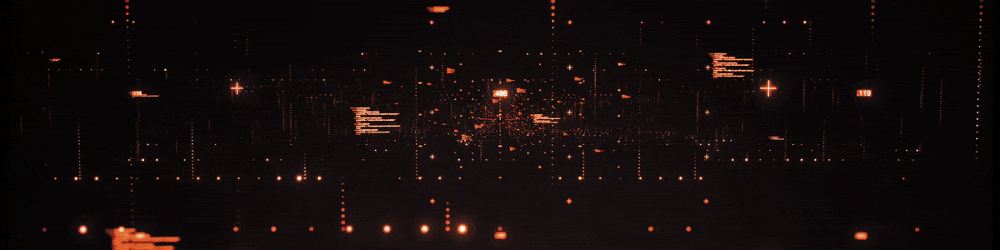
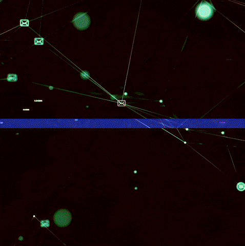

 
    

    🕵️  🕵️

<h2></h2>

<h2 align="center"> Hack and Hacking!</h2>   

* I'm CrowlKeyn, I'm not a hacker, but I aspire to be.   

* I’m currently learning about hacking!   

* Interest: Drink beer and more beer.   

* 2023 Goals: Learn anything ~~and drink more beer~~.   

* Hobbies: Same stuff, I just copied this...   

    <h2> <b>Technologies and Skills</b></h2>
    
    
      
    

    

 
    

